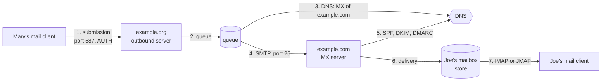

# How a mail server works, and where bumail fits

This page explains what a mail server does, piece by piece, and which
`@bumail/*` package handles each piece. Read it first. Each package's
README and `docs/guide.md` then go into the detail.

bumail is a mail server native to Bun. It is built as small packages, and
none of them has a runtime dependency. Each one does one job of a mail
server, and you can use it on its own. A server app wires them together.

## The journey of one message

Mary, at `example.org`, writes to Joe, at `example.com`:



1. **Submission.** Mary's client hands the message to her own server on
   port 587. It must log in first (SMTP AUTH), and only over TLS.
2. **Queue.** Her server takes responsibility for the message and puts it
   in a queue. If delivery fails for a while, the queue retries for days.
   If it gives up, it sends a bounce back to Mary.
3. **DNS.** To find who receives mail for `example.com`, the server looks
   up its MX records in DNS.
4. **Relay to the MX.** Her server connects to that MX on port 25 and
   sends the message over SMTP. Here it does not log in: an MX accepts mail
   *for its own domains* from anyone.
5. **Checks.** Joe's server asks whether the message really comes from
   `example.org`, through three standards:
   - **SPF**: may this IP address send for that domain?
   - **DKIM**: is the signature valid?
   - **DMARC**: what does the domain ask to be done with mail that fails?
6. **Delivery.** The message is filed in Joe's mailbox, and the result of
   the checks is written on top of it.
7. **Access.** Joe's client reads his mailbox over IMAP or JMAP.

Every numbered step is one part of a mail server. The sections below take
them one by one.

## The parts, and the package for each

| part | what it does | bumail | status |
| --- | --- | --- | --- |
| [Message format](#the-message-mime) | What an e-mail is: headers, body, attachments | [`@bumail/mime`](../packages/mime) | published |
| [SMTP, receiving](#smtp-receiving-mail) | Takes mail in: MX on 25, submission on 587 | [`@bumail/smtp`](../packages/smtp) | published, with the client on `@bumail/smtp/client` |
| [DNS](#dns) | MX, TXT, A, AAAA, PTR lookups; the records a domain publishes | [`@bumail/dns`](../packages/dns) | lookups published; record helpers next |
| [Authentication](#authentication-spf-dkim-dmarc) | SPF, DKIM, DMARC, Authentication-Results | [`@bumail/auth`](../packages/auth) | DKIM and SPF published; DMARC merged, not yet published |
| [Storage](#storage) | Accounts, mailboxes, messages, flags | [`@bumail/store`](../packages/store) | published (memory, SQLite) |
| [Queue and delivery](#queue-and-outbound-delivery) | Sends mail out, retries, bounces | [`@bumail/smtp/client`](../packages/smtp) and [`@bumail/queue`](../packages/queue) | client published; queue in progress, in review |
| [Mailbox access](#mailbox-access-imap-and-jmap) | Lets clients read mail | [`@bumail/imap`](../packages/imap), then `@bumail/jmap` | IMAP published; JMAP in review |
| [The server app](#the-server-app) | Wires everything together | an app on alxia | next |

The [roadmap](roadmap.md) holds the order, and the reasons for it.

## The message: MIME

**What it is.** An e-mail is text in a fixed shape (RFC 5322):

- header fields (`From`, `To`, `Subject`, `Date`, `Message-ID`…);
- a blank line;
- the body.

MIME (RFC 2045 and the RFCs after it) adds:

- **Parts:** a message can hold several parts, for example a text part, an
  HTML part and attachments (`multipart/*`).
- **Encodings:** base64 or quoted-printable carry binary data and long
  lines over a channel built for 7-bit text.
- **Character sets:** any charset for text bodies, and encoded-words
  (RFC 2047) for headers that are not plain ASCII, such as `=?utf-8?Q?R=C3=A9union?=`.

**Why it is hard.** Messages come from the whole world and are often
malformed. A server reads them without trusting them: it must never crash,
never slow down on an input crafted to be slow, and never hold an unbounded
message in memory.

**In bumail.** [`@bumail/mime`](../packages/mime) does three things:

- parses a message, or streams it in bounded memory;
- decodes headers, addresses, encodings and charsets;
- builds messages to send.

`@bumail/auth` reads headers through it, and folds the ones it writes
through it.

## SMTP: receiving mail

**What it is.** SMTP (RFC 5321) is the protocol mail travels by. A client
connects and the two sides exchange short commands and replies:

```text
S: 220 mx.example.com ESMTP
C: EHLO mail.example.org
S: 250-mx.example.com  …extensions…
C: MAIL FROM:<mary@example.org>
S: 250 2.1.0 OK
C: RCPT TO:<joe@example.com>
S: 250 2.1.5 OK
C: DATA
S: 354 End data with <CR><LF>.<CR><LF>
C: …the message…
C: .
S: 250 2.0.0 Queued
```

**The envelope and the header are not the same thing.**

- **The envelope** is `MAIL FROM` and `RCPT TO`. It is where the mail
  actually goes.
- **The header** is `From:` and `To:` inside the message. It is what the
  reader sees.

They often differ, for example with a mailing list or a blind copy. SPF
checks the envelope; DMARC protects the header `From`.

**Two roles, two ports.**

- **MX (port 25).** It takes mail for its own domains from any server,
  without login. It refuses every other recipient.
- **Submission (port 587, or 465 with implicit TLS).** Your own users log
  in (SMTP AUTH) and can send to anyone.

**The open relay.** A server that forwards mail for anyone, to anyone,
without a login is an open relay. Spammers find such servers within hours,
and the internet then blocks them. bumail never relays without
authentication: not as a default, not in a test, not as an option.

**Extensions.** A server announces them in its `EHLO` reply:

- `STARTTLS` (encryption);
- `AUTH` (login, offered only once the connection is encrypted);
- `SIZE` (size limit);
- `PIPELINING` (several commands at once);
- `8BITMIME` and `SMTPUTF8` (8-bit content and Unicode addresses);
- `ENHANCEDSTATUSCODES` (codes such as `5.7.1`).

**Reply codes.** `2xx` means accepted and `3xx` means go on. `4xx` is a
temporary failure, so the sender tries again later. `5xx` is permanent and
leads to a bounce.

**In bumail.** [`@bumail/smtp`](../packages/smtp) is the server, on
`Bun.listen`.

- It supports the extensions above, STARTTLS or implicit TLS, and AUTH
  PLAIN and LOGIN.
- Your app plugs in through hooks. One decides who may log in, one which
  domains are local, and `onData` receives each message as a stream.
- The client is told `250` only once your app has read the whole message
  and accepted it.
- It refuses SMTP smuggling (a bare LF or CR inside the message).

The client side, which sends mail out, is `@bumail/smtp/client` in the same
[package](../packages/smtp): `sendMail` delivers one message to a smarthost
or to a domain's MX hosts, which `resolveMx` looks up.

## DNS

**What it is.** DNS is the internet's directory. A mail server reads five
kinds of record from it:

| record | used for |
| --- | --- |
| `MX` | which servers receive mail for a domain, in order of preference |
| `A` / `AAAA` | the IPv4 / IPv6 address of a server |
| `TXT` | the SPF policy, the DKIM public keys, the DMARC policy |
| `PTR` | the name behind an IP address (reverse DNS) |

**The trap.** A missing answer is not the same as no answer:

- "This record does not exist" is final.
- "The DNS server did not answer" means try later.

Authentication turns the first into `none` or `fail`, and the second into
`temperror`, a temporary error. Mixing them up rejects good mail or accepts
forged mail.

**Publishing your own records.** To receive and send mail, a domain
publishes its MX, its SPF policy, its DKIM public keys and its DMARC
policy, and its sending IP needs a PTR that names the server. bumail will
write these records for you, as a zone file you import into Cloudflare or
another DNS host, or as plain records for its API: it is on the
[roadmap](roadmap.md#next).

**In bumail.** [`@bumail/dns`](../packages/dns) provides:

- one interface, `Resolver`, and its implementation on `node:dns`,
  `nodeResolver`;
- `fixtureResolver`, which answers from a table, for tests;
- `cachedResolver`, a cache in front of either that honours TTLs;
- `DnsError`, whose code always says which of the two cases happened
  (`isTemporary` tells you).

Names are normalised before they are sent. That includes international
names (IDN), which are converted to their ASCII form.

## Authentication: SPF, DKIM, DMARC

SMTP itself proves nothing: anyone can write `From: ceo@bank.example`.
Three standards, which work together, prove where a message comes from.

### SPF: may this IP send for this domain?

**SPF** (RFC 7208) works like this:

- A domain publishes a TXT record listing the IP addresses allowed to send
  its mail, such as `v=spf1 ip4:192.0.2.0/24 include:_spf.provider.example -all`.
- The receiving server checks the connecting IP against the list for the
  envelope domain (`MAIL FROM`).
- The answer is one of `pass`, `fail`, `softfail`, `neutral`, `none`,
  `temperror` or `permerror`.

Limits keep a hostile record from costing too much DNS: at most 10 lookups,
and at most 2 that find nothing.

**Its limit.** SPF checks the envelope, not the `From:` the reader sees,
and forwarding breaks it, because the forwarder's IP is not in the list.

### DKIM: is the signature valid?

**DKIM** (RFC 6376) has three steps:

1. **Signing.** The sending server signs chosen headers and the body with a
   private key, and adds a `DKIM-Signature: d=example.org; s=selector; …`
   field.
2. **Publishing the key.** The public key sits in DNS at
   `selector._domainkey.example.org`.
3. **Verifying.** The receiver fetches the key and checks the signature.

A signature that verifies proves two things:

- The domain `d=` took responsibility for the message.
- The signed parts have not changed since. Plain forwarding keeps the
  signature valid; a mailing list that edits the Subject or adds a footer
  breaks it.

**Algorithms:** rsa-sha256 (keys of 1024 bits at least) and ed25519-sha256
(RFC 8463).

**Canonicalisation:** `simple` or `relaxed`. It sets how much whitespace
change a signature tolerates.

### DMARC: what to do when it fails

**DMARC** (RFC 7489) ties the other two to the `From:` the reader sees.

**The record.** A domain publishes `_dmarc.example.org TXT "v=DMARC1;
p=reject; rua=mailto:…"`. The policy `p=` is one of `none`, `quarantine`
or `reject`.

**When a message passes.** It needs a DKIM signature that verifies
(`dkim=pass`) or an SPF pass, **whose domain is aligned with the `From:`
domain**. There are two modes:

- *strict*: the same domain;
- *relaxed*: the same organizational domain, so `mail.example.org` aligns
  with `example.org`.

**The organizational domain** comes from the Public Suffix List, which
knows that `example.co.uk` is a registrable domain while `co.uk` is not.

**When it fails.** The receiver applies the policy.

### Authentication-Results

The receiver records what it found in an `Authentication-Results:` header
(RFC 8601), on top of the message, so filters and the reader's client can
use it:

```text
Authentication-Results: mx.example.com;
  dkim=pass header.d=example.org header.s=sel header.b=AbCdEfGh;
  spf=pass smtp.mailfrom=example.org;
  dmarc=pass header.from=example.org
```

**ARC** (RFC 8617) is for a forwarder or a mailing list: it records the
results it saw, so that the next hop can trust them even though forwarding
broke SPF, or the list's edits broke DKIM.

**In bumail.** [`@bumail/auth`](../packages/auth):

- `verifyDkim` and `signDkim`: published in 0.1.0;
- `checkSpf`: published in 0.2.0;
- `checkDmarc` and `formatAuthenticationResults`: merged, not yet published;
- DMARC reports and ARC: next.

Every check answers with RFC 8601's words and never throws on a hostile
message. `checkSpf` runs the RFC 7208 test suite and was compared with
pyspf.

## Storage

**What it is.** Where the mail lives once delivered. It holds:

- **Accounts**, each with **mailboxes** (folders): Inbox, Sent, Drafts,
  Trash, Junk, Archive, and the user's own.
- **Messages**, with their **flags** (`\Seen`, `\Flagged`, `\Answered`…)
  and **keywords**.
- **Threads**: the replies grouped into one conversation.

**What the access protocols need from it.**

- **IMAP** numbers messages per mailbox with **UIDs** that only grow and
  are never reused. A `UIDVALIDITY` says when the numbering restarts.
- **JMAP** gives each message one id for its whole life, wherever it is
  filed.
- **Both** need to sync quickly: "what changed since I last looked?". That
  means a change counter, the **modseq**, and a record of what was deleted.

**Bytes and metadata.** A message's content, its **blob**, is large and
never changes. Its metadata, such as flags and mailboxes, is small and
changes often. Keeping the two apart lets a server put the bytes on disk or
S3 and the metadata in a database.

**In bumail.** [`@bumail/store`](../packages/store) is **one contract**,
`MailStore`, with several implementations:

- an in-memory store;
- a store on disk, on `bun:sqlite`, which writes the bytes with fsync before
  it commits;
- Next: PostgreSQL, MongoDB, and a separate blob store (disk, S3, GridFS).

Every implementation passes the same contract tests, so the SMTP server,
IMAP and JMAP never need to know which one they were given.

## Queue and outbound delivery

**What it is.** The part that sends mail out. It covers:

- **Finding the destination:** the recipient domain's MX records, by
  priority. With no MX, it falls back to the A or AAAA record. A "null MX"
  means the domain takes no mail.
- **Connecting securely:** STARTTLS whenever the other side offers it.
  MTA-STS (RFC 8461) can require it.
- **Coping with failure:**
  - after a `4xx`, retry with back-off, for several days;
  - after a `5xx` or too many tries, send a **bounce**, a delivery status
    notification (RFC 3464), back to the sender.
- **Signing with DKIM** before sending.

**In bumail.** The SMTP client is published, as
[`@bumail/smtp/client`](../packages/smtp): `sendMail` delivers one message,
to a smarthost or by MX, and says whether a failure is temporary.
[`@bumail/queue`](../packages/queue), in progress and in review, is the
queue on top of it:

- each recipient has its own state — pending, delivered, deferred or
  failed — with the last reply;
- an attempt opens one session per recipient domain, by MX, through a
  smarthost (around a blocked port 25), or by a route per domain;
- a `4xx`, a connection error or a timeout is retried with back-off (30
  minutes at first, given up after 5 days); a `5xx` fails at once;
- a failure, and a delay of 4 hours, send a DSN back to the sender, never
  about a bounce;
- a `QueueStore` contract with a memory and a `bun:sqlite` store, like the
  store; a worker claims an item with a lease, so several workers share
  one queue, and a crashed worker's items are claimed again.

DKIM signing happens before a message is enqueued, with `@bumail/auth`.
The queue sends what the app enqueues: the app decides who may send.

## Mailbox access: IMAP and JMAP

**What it is.** How a mail client reads and organises mail on the server.

- **JMAP** (RFC 8620, RFC 8621) is HTTP and JSON. It is simple, efficient
  on mobile, and syncs by change states.
- **IMAP** (RFC 9051) is the historical protocol, on its own long-lived
  connection. Almost every desktop client speaks it.
- **POP3** downloads and deletes. bumail does not plan it.

**In bumail.** [`@bumail/imap`](../packages/imap) came first, since it is
what Thunderbird, Apple Mail, Outlook and the phone clients speak, and so
what a real mail client tests bumail with. Its first slice is published in
0.1.0: IMAP4rev2, login only over TLS, IDLE, MOVE and SPECIAL-USE, serving
any `@bumail/store`. Its second slice will add CONDSTORE and QRESYNC (RFC 7162)
for quick resync, UIDPLUS (RFC 4315) and BINARY (RFC 3516).
`@bumail/jmap`, in review, follows as an
[alxia](https://github.com/softistx/alxia) app: alxia already provides the
routing, validation and typed client. Later, bumail
gets its own web mail client on JMAP, built on the same stack (alxia's
typed client, `@nxgt/material`); any other JMAP or IMAP client keeps
working.

## The server app

**What it is.** The program an operator runs. It wires the packages
together:

- SMTP on 25 (MX) and 587 (submission);
- the queue, the store, IMAP and JMAP;
- an admin API for domains, accounts, aliases and DKIM keys;
- health checks and metrics.

**In bumail.** It is next, built on alxia, once `@alxia/core` is on npm.

## Trying it

The first end-to-end tests run against **Mailpit**, a local mail catcher:
it receives what bumail sends and shows every message with its headers,
the DKIM signature included, and it can release a caught message to
bumail's MX. Then a real mail client (a MUA such as Thunderbird) logs in
over submission and reads its mailbox through bumail. The
[roadmap](roadmap.md#next) tracks both.

## Around the edges

These come later or are left out on purpose. The [roadmap](roadmap.md) says
why.

- **Filtering**
  - **Sieve** (RFC 5228): rules the user writes, applied at delivery.
  - **Spam scoring and greylisting:** bumail provides the hooks, and the
    operator chooses the classifier.
  - **Rate limits:** per sender, on submission.
- **Outbound TLS policy**
  - **MTA-STS and TLS-RPT:** a domain demands TLS, and gets reports on it.
  - **DANE:** not planned, since it needs DNSSEC validation, which
    `node:dns` does not give.
- **Webhooks:** on delivery, bounce or inbound mail.

## Words used across the docs

| word | meaning |
| --- | --- |
| **MUA** | Mail User Agent: the mail client (Thunderbird, a phone's Mail app…) |
| **MSA** | Mail Submission Agent: the server a user submits through, on port 587 |
| **MTA** | Mail Transfer Agent: a server that relays mail between domains |
| **MX** | the MTA that receives mail for a domain, and the DNS record that names it |
| **MDA** | Mail Delivery Agent: files the message into the mailbox |
| **envelope** | `MAIL FROM` and `RCPT TO`, the SMTP-level sender and recipients |
| **header From** | the `From:` field the reader sees, also called RFC5322.From |
| **relay** | passing a message on to another domain's server |
| **open relay** | a server that relays for anyone without login; bumail never is one |
| **bounce** | a message back to the sender saying delivery failed (DSN) |
| **blob** | a message's raw bytes, stored apart from its metadata |
| **UID / modseq** | a message's number in a mailbox / a change counter, for sync |
| **selector** | the name under which a DKIM key is published (`s=`) |
| **alignment** | DMARC's rule that the DKIM or SPF domain matches the From domain |
| **organizational domain** | the registrable domain (`example.co.uk`), from the Public Suffix List |

## What every bumail package keeps

These hold for every package. [AGENTS.md](../AGENTS.md) has the full rules.

- **No runtime dependency.** A package needs only Bun, other `@bumail/*`
  packages, and the peers AGENTS.md allows (such as the clients a store
  for PostgreSQL or MongoDB will use).
- **Bun only.** The repository is built and tested on Bun 1.4.2.
- **Never an open relay.** Relaying requires AUTH in every default and
  every test, and AUTH is offered only once the connection is encrypted.
- **Hostile input is the normal case.**
  - Messages are streamed in bounded memory.
  - Parsing is written to take time linear in the size of the input, and
    the specs feed large hostile inputs under a time bound.
  - A bad message gives a result, never a crash.
- **One contract, several implementations.** The store and the queue, and
  later the blob store, each pass the same specs whatever they run on.
- **Checked against the standards.** Specs use the RFCs' own examples and,
  where one exists, a published test suite.

## Where to go next

- A package's README: what it does, a copy-paste example, its API.
- Its `docs/guide.md`: every option, explained with examples.
- Its `docs/troubleshooting.md`: every error message, why it happens and
  how to fix it.
- [docs/roadmap.md](roadmap.md): what comes next, and why in that order.
